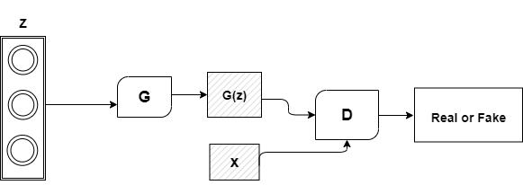
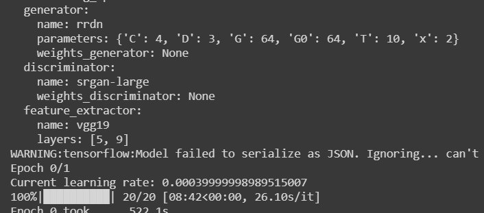
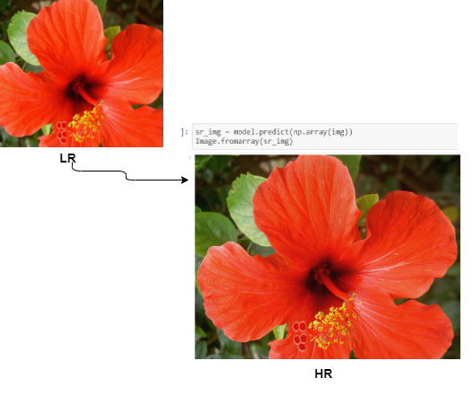

## Super-Resolution-with-GANs

#### Model Architecture of GANs

GANs are one of the deep generational models, they can
manage the generative problems well. In this section, we will
first present multiple types of deep generative models, which
are more common to use, and compare the differences
between them. Then, we'll introduce the basic GANs theory
and architecture. Supervised learning and unsupervised
learning are essentially two main types of problems that we
work on in machine learning or deep learning- In supervised
learning problems, we have the independent variables (x) and
the target mark (y).GANs are inspired by game theory, the generator and the
discriminator must compete with each other in the training
process to achieve the Nash equilibrium. 

GANs architecture is exemplified in figure above Generator G's concept is to produce fake
data to suit the future distribution of real data as much as
possible while discriminator D's concept is to correctly
differentiate real data from fake data. The generator input is a
random noise vector z (generally a uniform or normal
distribution). The noise is mapped to a new data space via
generator G to obtain a fake sample, G(z), which is a multidimensional vector. And, the discriminator D is a.binary
classifier,[3][4] it takes both.the real sample from the dataset,
and the fake sample generated by generator G.as the input, and
the output of discriminator D represents the probability that the sample is a real rather than a fake. When the discriminator
D cannot determine whether the data comes from the real
dataset or the generator, the optimal state is reached. A
generator model G is now obtained, Which has benefited from
real data delivery.

#### SR-GANs

Super-resolution is based on the idea that a combination of
low resolution (noisy) sequence of images of a scene can be
used to generate a high resolution image or image sequence.
Thus it attempts to reconstruct the original scene image with
high resolution given a set of observed images at lower
resolution.

#### Training Process:

#### Results

**DataSet used :** [DIV2K](https://www.kaggle.com/joe1995/div2k-dataset)  
